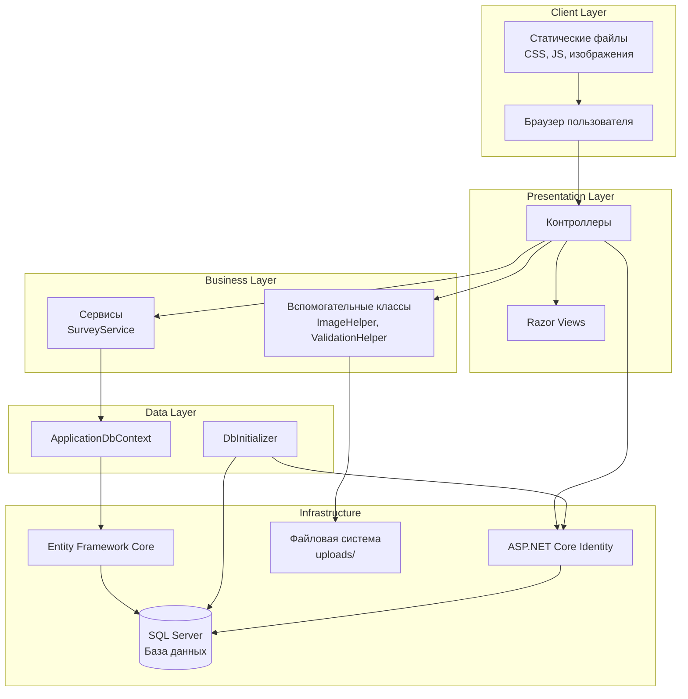
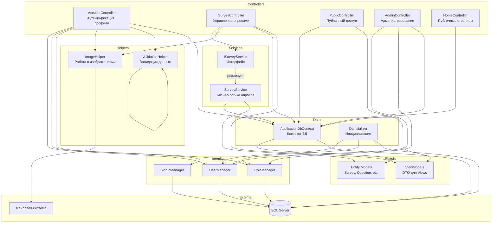
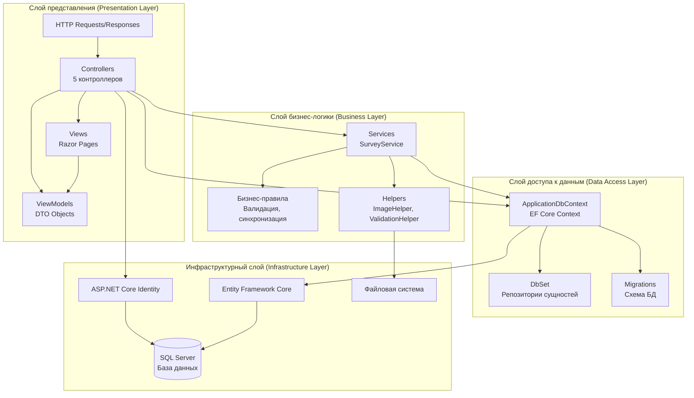
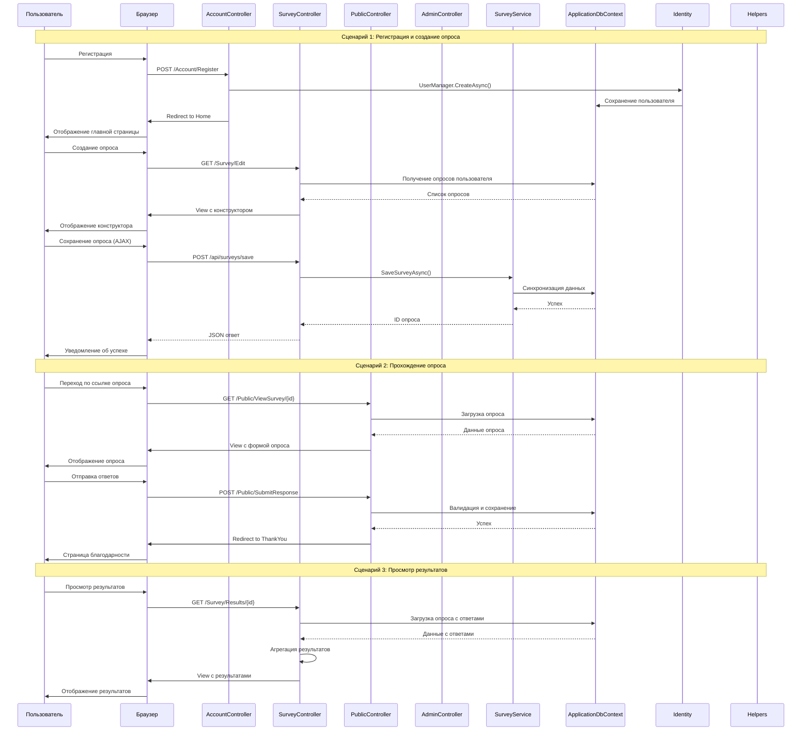
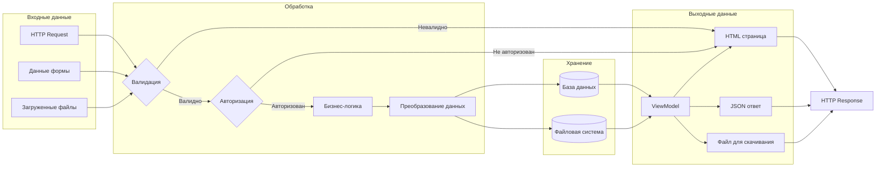
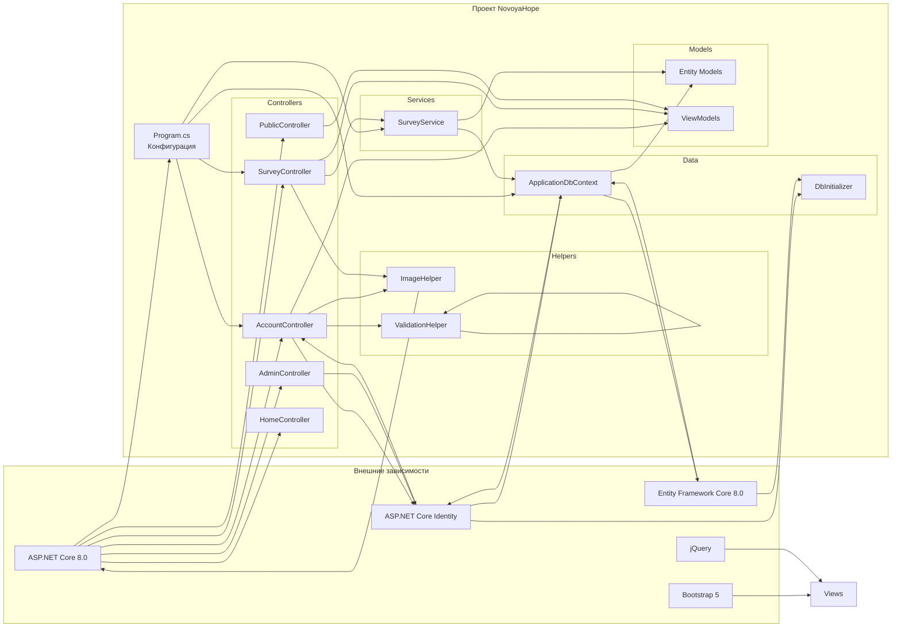
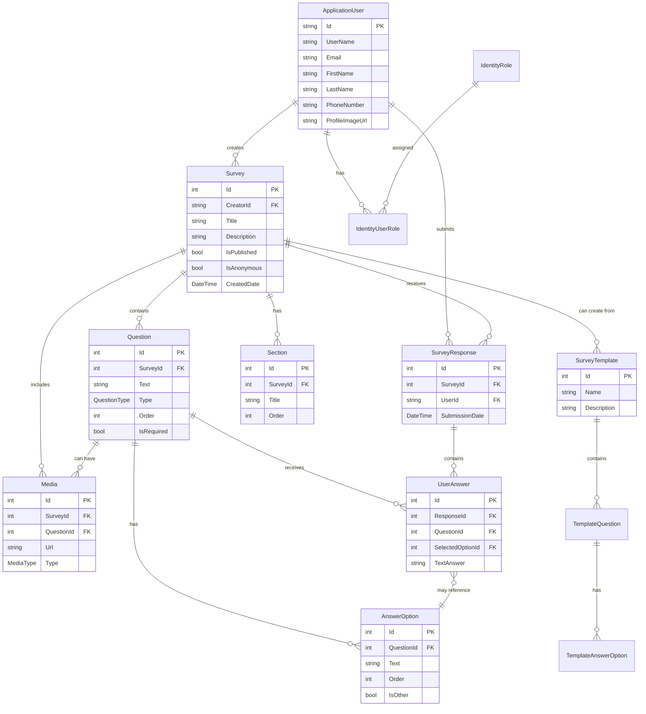
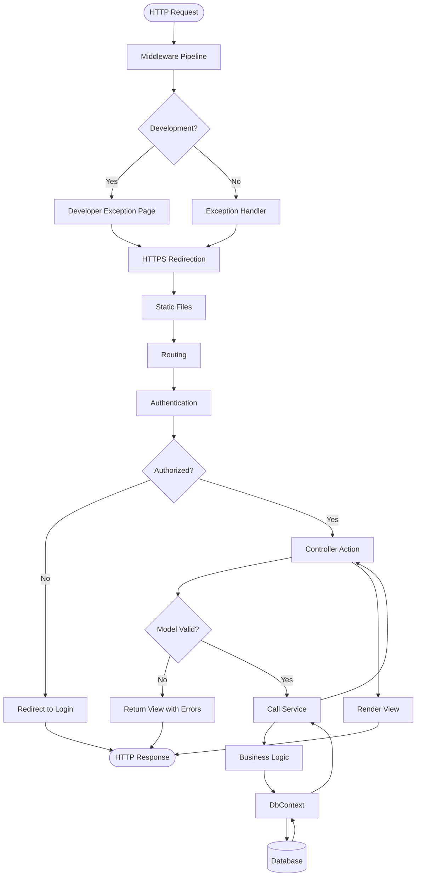
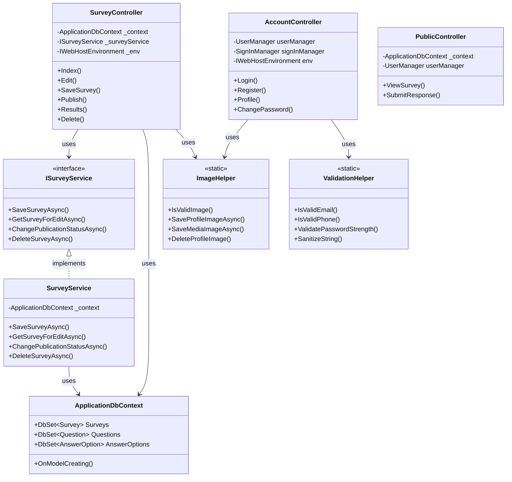
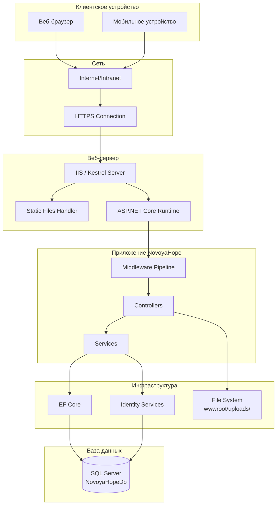

# Диаграммы компонентов - NovoyaHope

## Содержание

1. [Общая архитектура компонентов](#общая-архитектура-компонентов)
2. [Детальная диаграмма компонентов](#детальная-диаграмма-компонентов)
3. [Диаграмма слоев архитектуры](#диаграмма-слоев-архитектуры)
4. [Диаграмма взаимодействия контроллеров](#диаграмма-взаимодействия-контроллеров)
5. [Диаграмма потока данных](#диаграмма-потока-данных)
6. [Диаграмма зависимостей](#диаграмма-зависимостей)
7. [Диаграмма базы данных](#диаграмма-базы-данных)

---

## Общая архитектура компонентов



---

## Детальная диаграмма компонентов



---

## Диаграмма слоев архитектуры



---

## Диаграмма взаимодействия контроллеров



---

## Диаграмма потока данных



---

## Диаграмма зависимостей



---

## Диаграмма базы данных



---

## Диаграмма жизненного цикла запроса



---

## Диаграмма компонентов с интерфейсами



---

## Диаграмма развертывания



---

## Диаграмма потоков данных для создания опроса

```mermaid
flowchart TD
    Start([Пользователь создает опрос]) --> LoadView[Загрузка Edit View]
    LoadView --> DisplayConstructor[Отображение конструктора]
    
    DisplayConstructor --> UserInput[Ввод данных в конструкторе]
    UserInput --> JS[JavaScript constructor.js]
    
    JS --> BuildModel[Построение ViewModel]
    BuildModel --> AJAX[AJAX запрос /api/surveys/save]
    
    AJAX --> Controller[SurveyController.SaveSurvey]
    Controller --> Validate{Валидация}
    
    Validate -->|Ошибка| ErrorResponse[JSON Error]
    Validate -->|Успех| Service[SurveyService.SaveSurveyAsync]
    
    Service --> Sync[Синхронизация данных]
    Sync --> Questions[Обработка вопросов]
    Sync --> Options[Обработка вариантов]
    Sync --> Sections[Обработка разделов]
    Sync --> Media[Обработка медиа]
    
    Questions --> DbContext[ApplicationDbContext]
    Options --> DbContext
    Sections --> DbContext
    Media --> ImageHelper
    ImageHelper --> FileSystem[Сохранение файлов]
    ImageHelper --> DbContext
    
    DbContext --> SaveChanges[SaveChangesAsync]
    SaveChanges --> Transaction{Успех?}
    
    Transaction -->|Ошибка| Rollback[Откат транзакции]
    Transaction -->|Успех| Success[JSON Success + Survey ID]
    
    Rollback --> ErrorResponse
    Success --> JS
    ErrorResponse --> JS
    
    JS --> UpdateUI[Обновление UI]
    UpdateUI --> End([Опрос сохранен])
    ```

---

## Условные обозначения диаграмм

### Стрелки и соединения

- `-->` - Направленная зависимость
- `-.->` - Реализация интерфейса
- `-->|метка|` - Аннотированная зависимость
- `||--o{` - Связь один-ко-многим (ER-диаграммы)
- `}o--||` - Связь многие-к-одному (ER-диаграммы)

### Фигуры

- **Прямоугольник** - Компонент/класс
- **Прямоугольник с двойными границами** - Интерфейс
- **Ромб** - Условие/решение
- **Цилиндр** - База данных
- **Овал** - Начало/конец процесса
- **Параллелограмм** - Ввод/вывод данных

### Цвета (в визуализаторах)

- **Синий** - Контроллеры
- **Зеленый** - Сервисы
- **Оранжевый** - Helpers
- **Фиолетовый** - Data/Models
- **Красный** - Внешние зависимости

---

## Инструменты для просмотра диаграмм

Эти диаграммы написаны на языке **Mermaid**, который поддерживается:

1. **GitHub/GitLab** - автоматически рендерят в README.md
2. **Visual Studio Code** - через расширение "Markdown Preview Mermaid Support"
3. **Онлайн редакторы**:
   - [Mermaid Live Editor](https://mermaid.live/)
   - [Mermaid.ink](https://mermaid.ink/)
4. **Другие Markdown редакторы** - Typora, Obsidian, и т.д.

### Альтернативные форматы

Для создания изображений из Mermaid диаграмм:

```bash
# Установка Mermaid CLI
npm install -g @mermaid-js/mermaid-cli

# Генерация PNG
mmdc -i COMPONENT_DIAGRAMS.md -o diagrams.png

# Генерация SVG
mmdc -i COMPONENT_DIAGRAMS.md -o diagrams.svg
```

---

## Версия документации

- **Версия**: 1.0
- **Дата**: 2025
- **Автор**: NovoyaHope Development Team
- **Формат диаграмм**: Mermaid
- **Последнее обновление**: Соответствует коду на момент создания документации

---

## Связанная документация

- `PROJECT_STRUCTURE_DOCUMENTATION.md` - Структура проекта
- `SERVER_LOGIC_DOCUMENTATION.md` - Серверная логика
- `DATABASE_DOCUMENTATION.md` - База данных
- `SYSTEM_DESIGN.md` - Дизайн системы

